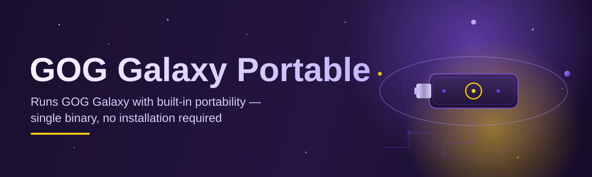
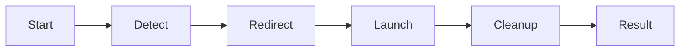

# gog-galaxy-portable-manager 🎮📦

  

*A drive-friendly companion that turns GOG Galaxy into a client you can carry, launch, and walk away from — no trace left behind.*

  

## 📖 Overview

Every long-time GOG user has hit the same wall at some point: you love the DRM-free philosophy, you love owning your installers outright, but the official Galaxy client insists on planting itself deep into `%APPDATA%`, the registry, and every corner of your system drive it can reach. If you swap PCs often, dual-boot, run a library off an external SSD, or just like keeping your main OS install lean, that behavior fights against the exact reason you chose GOG in the first place.

**gog-galaxy-portable-manager** exists to close that gap. It's a lightweight orchestration layer around GOG Galaxy that manages configuration, profile data, and launch behavior from a self-contained folder — the kind you can drop on a USB stick, a NAS-mounted drive, or a secondary partition and have it behave identically wherever it lands. Nothing is silently written outside the folder you choose, and nothing lingers after you're done.

This project is for the shelf-and-carry crowd: LAN party regulars, students on shared lab machines, digital hoarders with meticulously organized external drives, and anyone who simply believes a "portable" label should mean something. It's not a replacement for GOG Galaxy — it's the missing glue that makes the *portable* promise actually true.

## 🚀 Get Started

> [!TIP]
> Bookmark the landing page above — it always points to the current build, so you never have to hunt through old release notes.

---

## 🧩 What's Inside the Toolbox

Rather than a wall of bullet points, here's the capability set laid out side by side so you can scan what matters to your setup:

| Capability | What It Actually Does |
|---|---|
| **Self-Contained Profiles** | Keeps GOG Galaxy's config, cache, and login session inside your chosen folder instead of scattering them across `%APPDATA%` and the registry. |
| **Drive-Hop Ready** | Move the folder between a USB stick, external SSD, or a different PC entirely — your library view and settings travel with it. |
| **Zero Residue Mode** | Optional cleanup pass removes temporary launch artifacts on exit, so the host machine looks untouched when you unplug. |
| **Multi-Instance Sandboxing** | Run separate Galaxy profiles side by side — useful for shared family PCs or testing mod configurations in isolation. |
| **Launch Shortcut Builder** | Generates portable `.lnk` shortcuts for individual games that respect your relocated data path automatically. |
| **Offline-First Handling** | Gracefully degrades when GOG's servers are unreachable, keeping your locally installed games launchable. |
| **Update Awareness** | Detects when the bundled Galaxy client is behind and offers a guided refresh without touching your saved profile data. |
| **Lightweight Footprint** | The manager itself adds only a thin wrapper — it doesn't fork or reimplement Galaxy, it choreographs it. |

> [!NOTE]
> The manager works *with* the official GOG Galaxy client, not as a substitute. Think of it as a stage manager, not the actor.

### How to Get Started

1. **Visit the landing page** linked in the download button above.

2. **Download** the latest packaged release for Windows.

3. **Extract** the archive to any folder — a USB drive, an external SSD, or a local directory all work identically.

4. **Run** the launcher executable inside that folder. Galaxy boots up pointed at your portable profile automatically.

📋 First-run checklist (click to expand)

 

- Confirm the folder has write permissions (important on some external drives formatted as read-only by default).

- If prompted, sign in to your GOG account once — the session token stays local to the portable folder.

- Point the manager at your existing game installation folders if you're migrating from a standard install.

- Optionally enable Zero Residue Mode from Settings if you plan to use a shared or public machine.

## 💻 System Requirements

> [!IMPORTANT]
> This is a standalone Windows tool. There are no separate runtimes, frameworks, or background services to install — everything needed ships inside the download.

- **OS:** Windows 10 (64-bit) or Windows 11

- **Disk:** Roughly 200 MB free for the manager itself, plus whatever your GOG library requires

- **Dependencies:** None — no .NET installer prompts, no Visual C++ redistributable hunts

- **Permissions:** Standard user account is sufficient; admin rights not required for portable mode

- **Drive type:** Works on internal SSD/HDD, external USB drives, and network shares (with some latency trade-offs)

## 🔍 How It Works

The architecture is intentionally simple — three moving parts that hand off responsibility cleanly:

1. **Detection** — On launch, the manager scans the folder it's running from and locates (or initializes) a profile directory.

2. **Redirection** — It configures environment variables and local config pointers so GOG Galaxy reads/writes exclusively within that portable folder.

3. **Handoff** — The official Galaxy executable is launched under this redirected context, unaware it's running portably.

4. **Session Watch** — The manager monitors the process; on exit, it optionally triggers the cleanup pass for Zero Residue Mode.

5. **Persistence** — All profile changes — installed games, settings, cached artwork — are written back to your portable folder, ready for the next machine.

## 🛟 Troubleshooting

**Q: Galaxy still writes files to `%APPDATA%` even after I set up the portable folder — why?**
A: This usually happens if Galaxy was already installed traditionally beforehand. Uninstall the standard client first, or run the manager's "clean handoff" option to force redirection.

**Q: My games won't launch when I move the drive to a different PC.**
A: Double-check that installed game paths inside the portable profile are relative, not absolute. Re-run the Launch Shortcut Builder after relocating.

**Q: The manager says my GOG session expired every time I plug in the drive.**
A: Some antivirus suites quarantine session tokens on removable media. Add the portable folder to your AV's exclusion list.

**Q: Can I run two instances at once on the same PC?**
A: Yes — Multi-Instance Sandboxing supports this, but each instance needs its own folder to avoid file-lock conflicts.

**Q: Does Zero Residue Mode delete my save games too?**
A: No — it only clears temporary launch artifacts and cache. Save data and installed games are always preserved unless you explicitly delete them.

**Q: Why is first launch on a USB 2.0 drive so slow?**
A: Cold reads on older USB standards are the bottleneck, not the manager. USB 3.0+ or an external SSD resolves this almost entirely.

## 🎨 UI / UX Details

The interface leans minimal on purpose — this is a tool you should barely notice once it's working.

| Shortcut | Action |
|---|---|
| `Ctrl+O` | Open a different portable profile folder |
| `Ctrl+L` | Launch GOG Galaxy with current profile |
| `Ctrl+Shift+C` | Trigger manual cleanup pass |
| `F5` | Refresh detected game list |
| `Ctrl+,` | Open Settings |

- **Themes:** Light, Dark, and an OLED-friendly "Midnight" variant, switchable from Settings without a restart.

- **Settings persistence:** All UI preferences are stored inside the portable profile itself — so your theme choice travels with the drive too.

- **Tray behavior:** Optional minimize-to-tray while a game session is active, keeping the manager out of the way.

> [!WARNING]
> Switching themes mid-download of a large title can briefly freeze the progress panel — this is a known cosmetic quirk, not a stalled download.

## 🤝 Contributing & Community

This project grew out of shared frustration in the GOG community forums, and it stays alive the same way — through people who hit an edge case, fix it, and send it back.

> [!NOTE]
> Labeled `good first issue` tickets are curated specifically for newcomers to open-source or to this codebase. No prior experience with portable app packaging required.

- Found a bug? Open an issue with your Windows build, drive type, and repro steps.

- Have a feature idea? Start a discussion thread before opening a PR — saves everyone rework.

- Want to help with docs, translations, or the landing page design? Those PRs are just as welcome as code.

- First-time contributors: check the `good-first-issue` and `help-wanted` labels — maintainers actively mentor through review comments.

  

---

## 📜 License

Released under the [MIT License](LICENSE), 2026. Use it, fork it, ship it in your own toolkit — just keep the license notice intact.

## ⚠️ Disclaimer

This project is an independent, community-built utility and is not affiliated with, endorsed by, or officially connected to GOG.com, CD Projekt, or the GOG Galaxy client development team. "GOG Galaxy" and related marks belong to their respective owners. Use this tool in accordance with GOG's terms of service.

---

